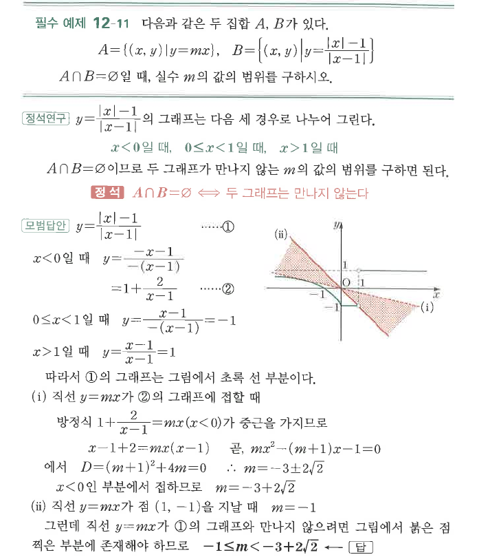
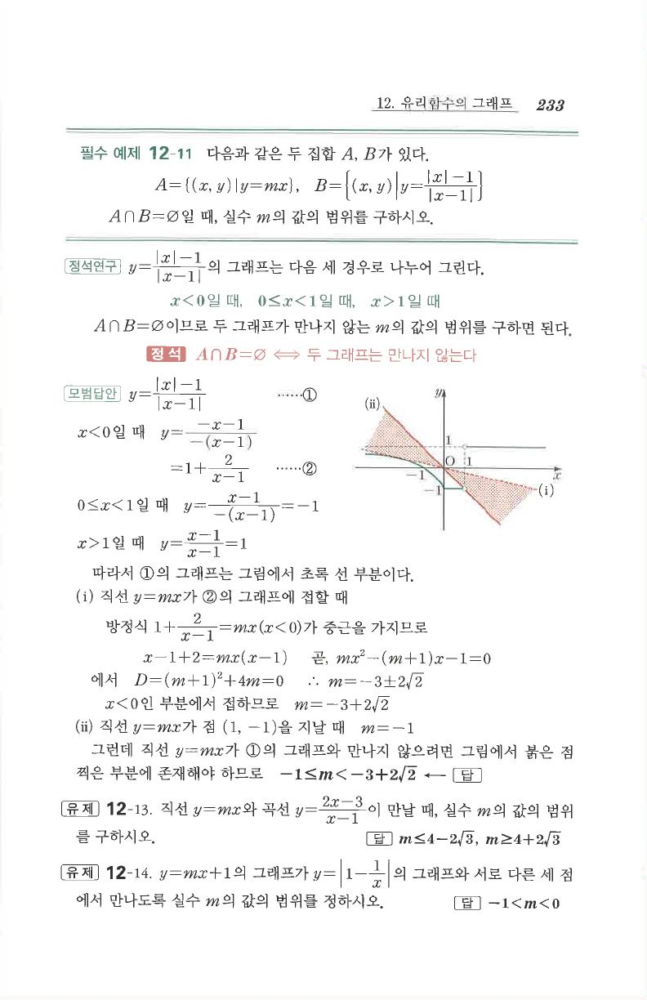

# 필수 예제 12-11

## 문제

다음과 같은 두 집합 $A$, $B$가 있다.
$$A=\{(x,y)\mid y=mx\},\qquad B=\left\{(x,y)\mid y=\frac{|x|-1}{|x-1|}\right\}$$
$A\cap B=\varnothing$일 때, 실수 $m$의 값의 범위를 구하시오.

## 정답

$-1\le m<-3+2\sqrt2$

## 도형

$B$의 그래프는 $x<0$, $0\le x<1$, $x>1$의 세 구간으로 나뉜다. 직선 $y=mx$가 이 그래프와 만나지 않도록 하는 기울기 범위를 찾는다.

## 원문

