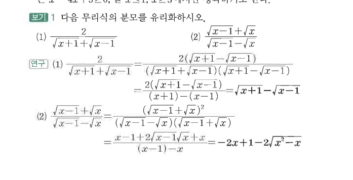
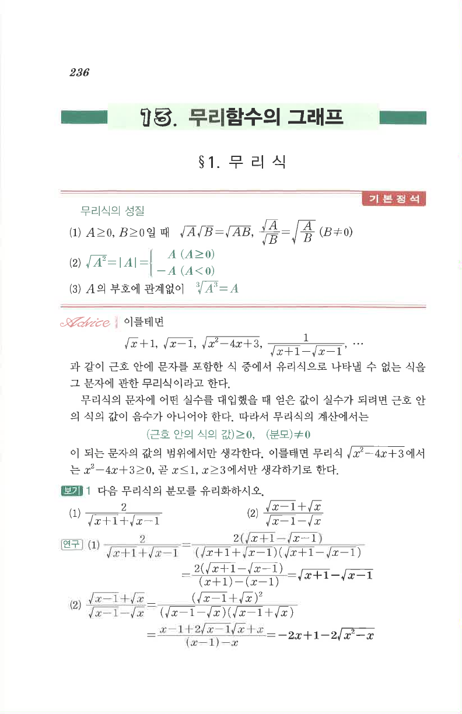

# S1 보기 1

## 문제

다음 무리식의 분모를 유리화하시오.

1. $\dfrac2{\sqrt{x+1}+\sqrt{x-1}}$
2. $\dfrac{\sqrt{x-1}+\sqrt{x}}{\sqrt{x-1}-\sqrt{x}}$

## 정답

1. $\sqrt{x+1}-\sqrt{x-1}$
2. $-2x+1-2\sqrt{x^2-x}$

## 원문

