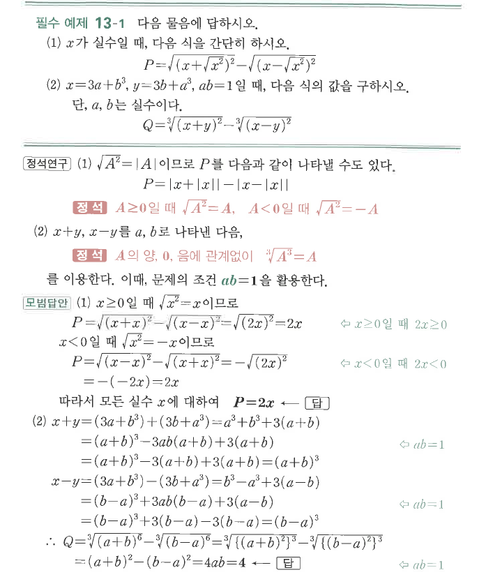

# 필수 예제 13-1

## 문제

다음 물음에 답하시오.

1. $x$가 실수일 때, 다음 식을 간단히 하시오.
$$P=\sqrt{(x+\sqrt{x^2})^2}-\sqrt{(x-\sqrt{x^2})^2}$$
2. $x=3a+b^3$, $y=3b+a^3$, $ab=1$일 때, 다음 식의 값을 구하시오. 단, $a$, $b$는 실수이다.
$$Q=\sqrt[3]{(x+y)^2}-\sqrt[3]{(x-y)^2}$$

## 정답

1. $P=2x$
2. $Q=4$

## 원문

