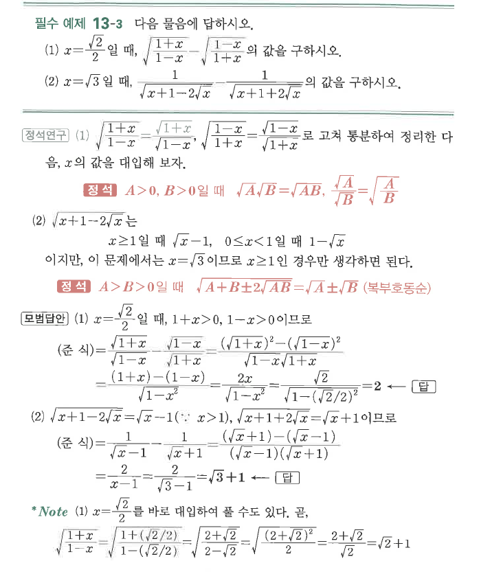

# 필수 예제 13-3

## 문제

다음 물음에 답하시오.

1. $x=\dfrac{\sqrt2}{2}$일 때,
$$\sqrt{\frac{1+x}{1-x}}-\sqrt{\frac{1-x}{1+x}}$$
의 값을 구하시오.
2. $x=\sqrt3$일 때,
$$\frac1{\sqrt{x+1-2\sqrt{x}}}-\frac1{\sqrt{x+1+2\sqrt{x}}}$$
의 값을 구하시오.

## 정답

1. $2$
2. $\sqrt3+1$

## 원문

