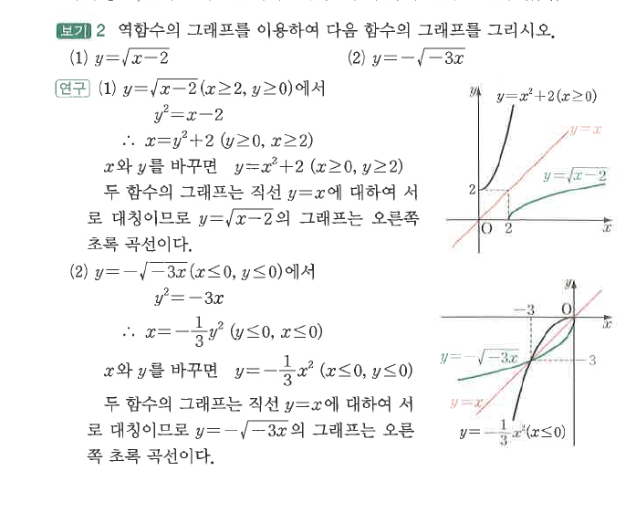
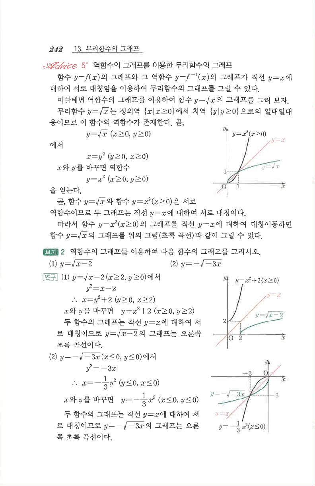

# S2 보기 2

## 문제

역함수의 그래프를 이용하여 다음 함수의 그래프를 그리시오.

1. $y=\sqrt{x-2}$
2. $y=-\sqrt{-3x}$

## 도형

(1)은 $y=x^2+2\ (x\ge0)$와 직선 $y=x$에 대하여 대칭이다. (2)는 $y=-\frac13x^2\ (x\le0)$와 직선 $y=x$에 대하여 대칭이다.

## 원문

