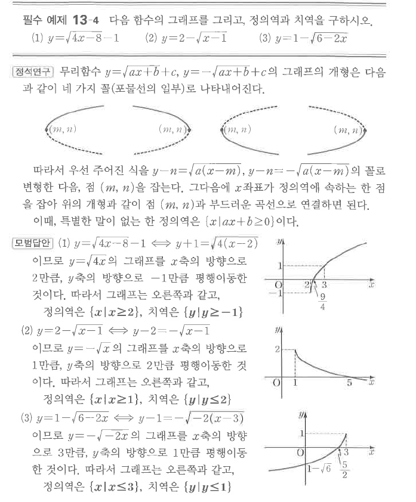

# 필수 예제 13-4

## 문제

다음 함수의 그래프를 그리고, 정의역과 치역을 구하시오.

1. $y=\sqrt{4x-8}-1$
2. $y=2-\sqrt{x-1}$
3. $y=1-\sqrt{6-2x}$

## 정답

1. 정의역 $\{x\mid x\ge2\}$, 치역 $\{y\mid y\ge-1\}$
2. 정의역 $\{x\mid x\ge1\}$, 치역 $\{y\mid y\le2\}$
3. 정의역 $\{x\mid x\le3\}$, 치역 $\{y\mid y\le1\}$

## 도형

각 그래프는 $y=\sqrt{x}$ 또는 $y=-\sqrt{x}$의 평행이동과 좌우 반전으로 얻는다. 시작점은 각각 $(2,-1)$, $(1,2)$, $(3,1)$이다.

## 원문

