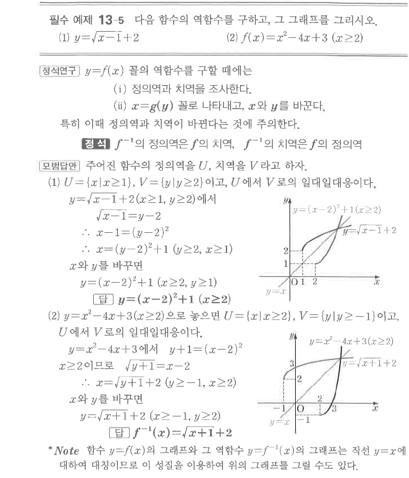

# 필수 예제 13-5

## 문제

다음 함수의 역함수를 구하고, 그 그래프를 그리시오.

1. $y=\sqrt{x-1}+2$
2. $f(x)=x^2-4x+3\quad(x\ge2)$

## 정답

1. $y=(x-2)^2+1\quad(x\ge2)$
2. $f^{-1}(x)=\sqrt{x+1}+2$

## 도형

함수와 역함수의 그래프는 직선 $y=x$에 대하여 대칭이다. 정의역과 치역이 서로 바뀌는 점에 주의한다.

## 원문

