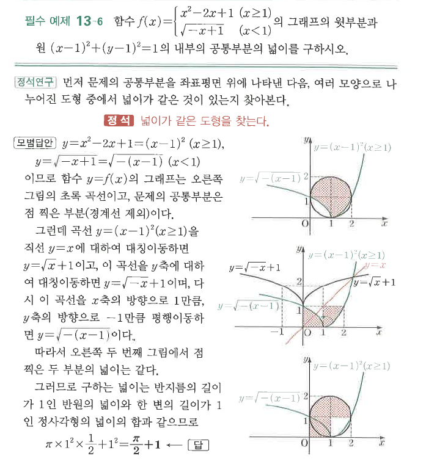
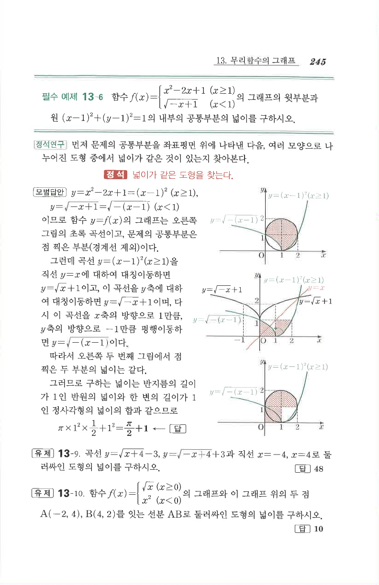

# 필수 예제 13-6

## 문제

함수
$$
f(x)=\begin{cases}
x^2-2x+1 & (x\ge1)\\
\sqrt{-x+1} & (x<1)
\end{cases}
$$
의 그래프의 윗부분과 원 $(x-1)^2+(y-1)^2=1$의 내부의 공통부분의 넓이를 구하시오.

## 정답

$\dfrac{\pi}{2}+1$

## 도형

그래프는 $x\ge1$에서 포물선 $y=(x-1)^2$, $x<1$에서 무리함수 $y=\sqrt{-(x-1)}$로 이루어진다. 원의 내부와 겹치는 윗부분의 음영 넓이를 구한다.

## 원문

