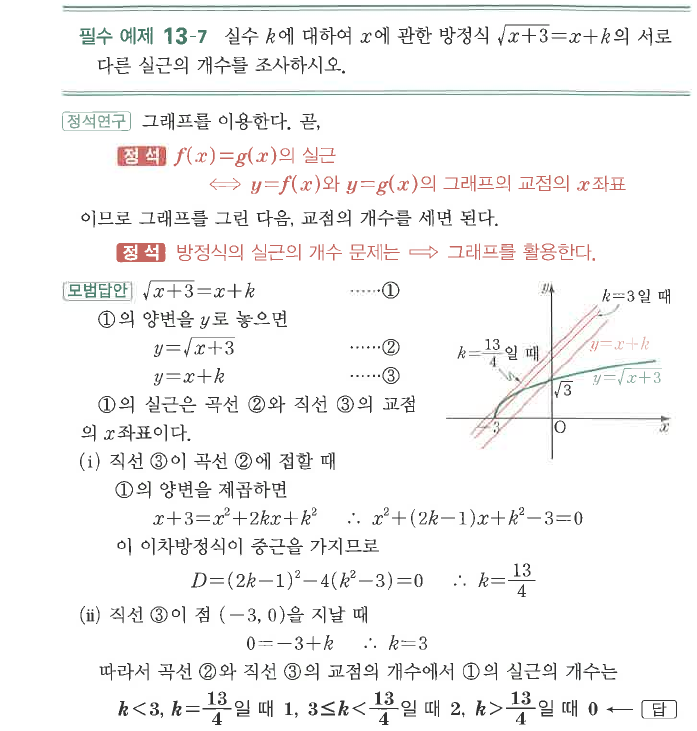

# 필수 예제 13-7

## 문제

실수 $k$에 대하여 $x$에 관한 방정식
$$\sqrt{x+3}=x+k$$
의 서로 다른 실근의 개수를 조사하시오.

## 정답

$k<3$ 또는 $k=\dfrac{13}{4}$일 때 $1$개, $3\le k<\dfrac{13}{4}$일 때 $2$개, $k>\dfrac{13}{4}$일 때 $0$개이다.

## 도형

곡선 $y=\sqrt{x+3}$과 직선 $y=x+k$의 교점 개수를 세는 문제이다. 접할 때와 직선이 시작점 $(-3,0)$을 지날 때가 경계가 된다.

## 원문

