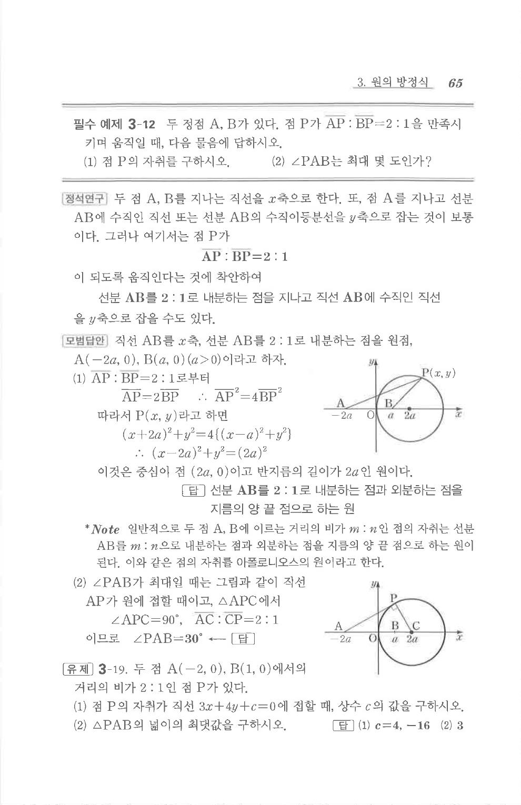

# 유제 3-19

## 문제

두 점 $A(-2,0)$, $B(1,0)$에서의 거리의 비가 $2:1$인 점 $P$가 있다.

1. 점 $P$의 자취가 직선 $3x+4y+C=0$에 접할 때, 상수 $C$의 값을 구하시오.
2. $\triangle PAB$의 넓이의 최댓값을 구하시오.

## 정답

1. $C=4,\ -16$  
2. $3$

## 원문 문제

## 원문

