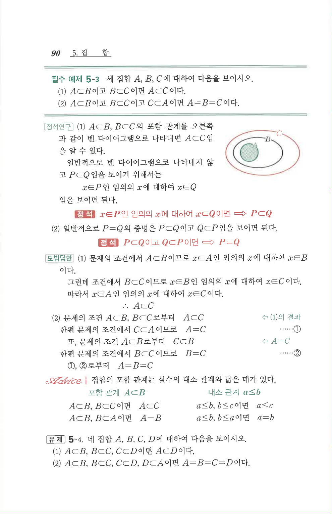

# 유제 5-4

## 문제

네 집합 $A$, $B$, $C$, $D$에 대하여 다음을 보이시오.

1. $A\subset B$, $B\subset C$, $C\subset D$이면 $A\subset D$이다.
2. $A\subset B$, $B\subset C$, $C\subset D$, $D\subset A$이면 $A=B=C=D$이다.

## 원문 문제

## 원문

