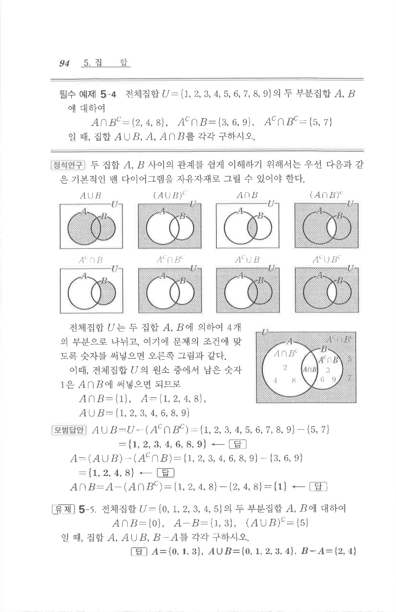

# 유제 5-5

## 문제

전체집합 $U=\{0,1,2,3,4,5\}$의 두 부분집합 $A$, $B$에 대하여

$$A\cap B=\{0\},\quad A-B=\{1,3\},\quad (A\cup B)^C=\{5\}$$

일 때, 집합 $A$, $A\cup B$, $B-A$를 각각 구하시오.

## 정답

$A=\{0,1,3\}$, $A\cup B=\{0,1,2,3,4\}$, $B-A=\{2,4\}$

## 원문 문제

## 원문

