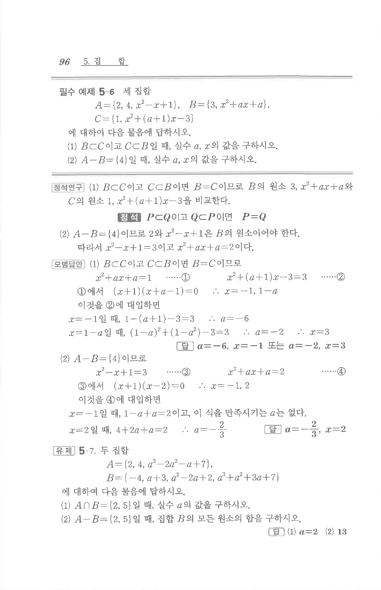

# 유제 5-7

## 문제

두 집합

$A=\{2,4,a^3-2a^2-a+7\}$,

$B=\{-4,a+3,a^2-2a+2,a^3+a^2+3a+7\}$

에 대하여 다음 물음에 답하시오.

1. $A\cap B=\{2,5\}$일 때, 실수 $a$의 값을 구하시오.
2. $A-B=\{2,5\}$일 때, 집합 $B$의 모든 원소의 합을 구하시오.

## 정답

1. $a=2$
2. $13$

## 원문 문제

## 원문

