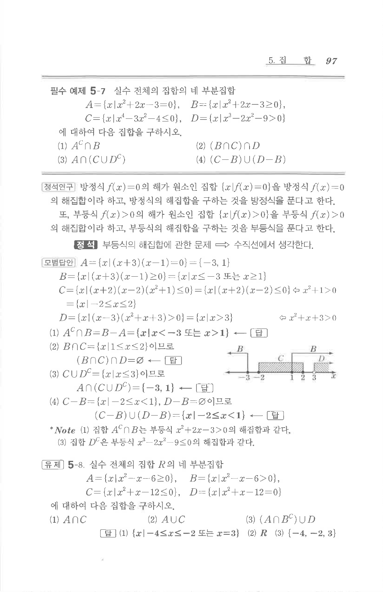

# 유제 5-8

## 문제

실수 전체의 집합 $R$의 네 부분집합

$A=\{x\mid x^2-x-6\ge0\}$, $B=\{x\mid x^2-x-6>0\}$,

$C=\{x\mid x^2+x-12\le0\}$, $D=\{x\mid x^2+x-12=0\}$

에 대하여 다음 집합을 구하시오.

1. $A\cap C$
2. $A\cup C$
3. $(A\cap B^C)\cup D$

## 정답

1. $\{x\mid -4\le x\le -2\text{ 또는 }x=3\}$
2. $R$
3. $\{-4,-2,3\}$

## 원문 문제

## 원문

