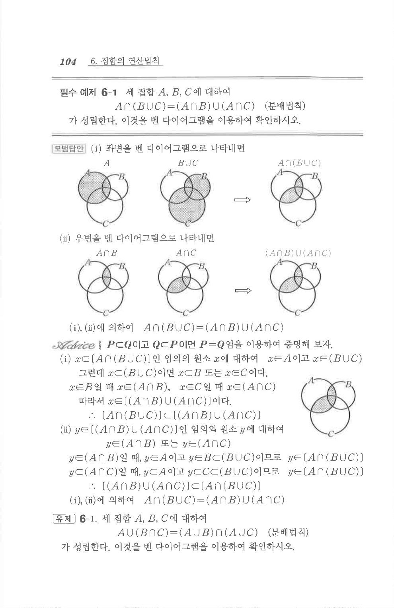

# 유제 6-1

## 문제

세 집합 $A$, $B$, $C$에 대하여

$$A\cup(B\cap C)=(A\cup B)\cap(A\cup C)\quad\text{(분배법칙)}$$

가 성립한다. 이것을 벤 다이어그램을 이용하여 확인하시오.

## 도형

좌변과 우변을 각각 세 집합의 벤 다이어그램으로 나타내어 같은 영역이 색칠되는지 확인하는 문제이다.

## 원문 문제

## 원문

