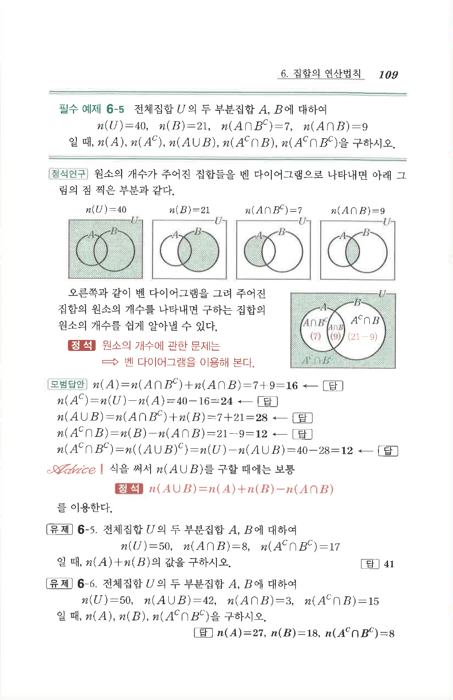

# 유제 6-6

## 문제

전체집합 $U$의 두 부분집합 $A$, $B$에 대하여

$$n(U)=50,\quad n(A\cup B)=42,\quad n(A\cap B)=3,\quad n(A^C\cap B)=15$$

일 때, $n(A)$, $n(B)$, $n(A^C\cap B^C)$를 구하시오.

## 정답

$n(A)=27$, $n(B)=18$, $n(A^C\cap B^C)=8$

## 원문 문제

## 원문

