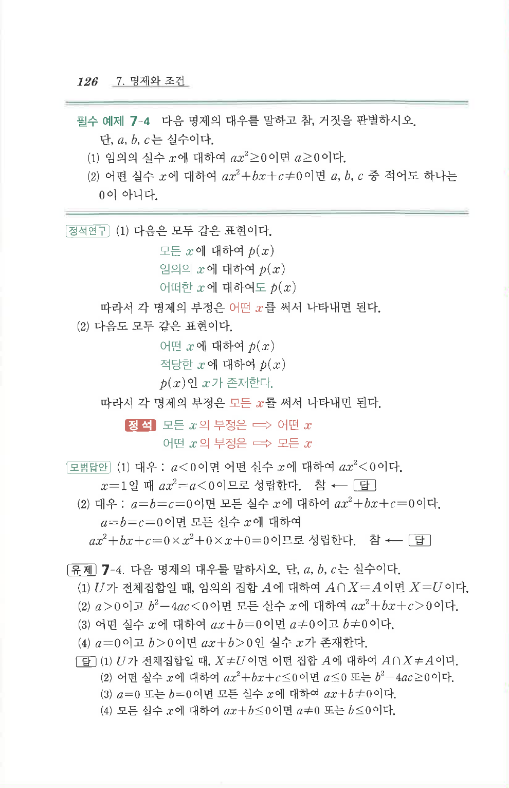

# 유제 7-4

## 문제

다음 명제의 대우를 말하시오. 단, $a$, $b$, $c$는 실수이다.

1. $U$가 전체집합일 때, 임의의 집합 $A$에 대하여 $A\cap X=A$이면 $X=U$이다.
2. $a>0$이고 $b^2-4ac<0$이면 모든 실수 $x$에 대하여 $ax^2+bx+c>0$이다.
3. 어떤 실수 $x$에 대하여 $ax+b=0$이면 $a\ne0$이고 $b\ne0$이다.
4. $a=0$이고 $b>0$이면 $ax+b>0$인 실수 $x$가 존재한다.

## 정답

1. $U$가 전체집합일 때, $X\ne U$이면 어떤 집합 $A$에 대하여 $A\cap X\ne A$이다.
2. 어떤 실수 $x$에 대하여 $ax^2+bx+c\le0$이면 $a\le0$ 또는 $b^2-4ac\ge0$이다.
3. $a=0$ 또는 $b=0$이면 모든 실수 $x$에 대하여 $ax+b\ne0$이다.
4. 모든 실수 $x$에 대하여 $ax+b\le0$이면 $a\ne0$ 또는 $b\le0$이다.

## 원문 문제

## 원문

