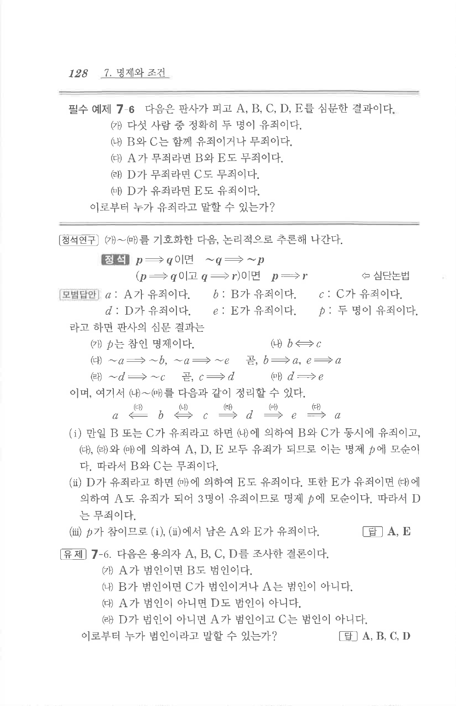

# 유제 7-6

## 문제

다음은 용의자 $A$, $B$, $C$, $D$를 조사한 결론이다.

가. $A$가 범인이면 $B$도 범인이다.  
나. $B$가 범인이면 $C$가 범인이거나 $A$는 범인이 아니다.  
다. $A$가 범인이 아니면 $D$도 범인이 아니다.  
라. $D$가 범인이 아니면 $A$가 범인이고 $C$는 범인이 아니다.

이로부터 누가 범인이라고 말할 수 있는가?

## 정답

$A$, $B$, $C$, $D$

## 원문 문제

## 원문

