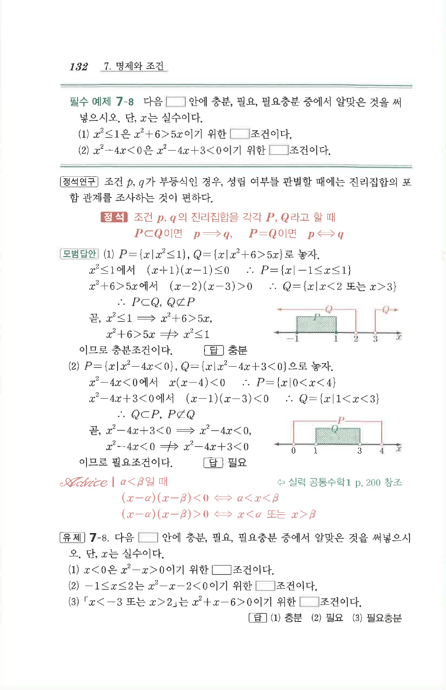

# 유제 7-8

## 문제

다음 $\square$ 안에 충분, 필요, 필요충분 중에서 알맞은 것을 써넣으시오. 단, $x$는 실수이다.

1. $x<0$은 $x^2-x>0$이기 위한 $\square$ 조건이다.
2. $-1\le x\le2$는 $x^2-x-2<0$이기 위한 $\square$ 조건이다.
3. 「$x<-3$ 또는 $x>2$」는 $x^2+x-6>0$이기 위한 $\square$ 조건이다.

## 정답

1. 충분
2. 필요
3. 필요충분

## 원문 문제

## 원문

