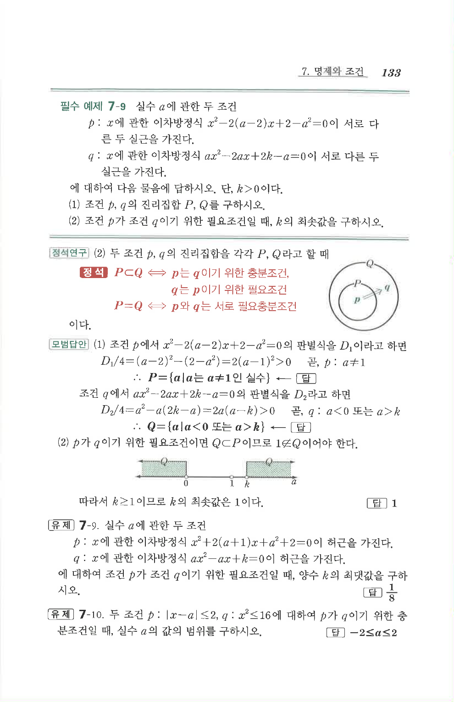

# 유제 7-9

## 문제

실수 $a$에 관한 두 조건

$p$: $x$에 관한 이차방정식 $x^2+2(a+1)x+a^2+2=0$이 허근을 가진다.

$q$: $x$에 관한 이차방정식 $ax^2-ax+k=0$이 허근을 가진다.

에 대하여 조건 $p$가 조건 $q$이기 위한 필요조건일 때, 양수 $k$의 최댓값을 구하시오.

## 정답

$\dfrac18$

## 원문 문제

## 원문

