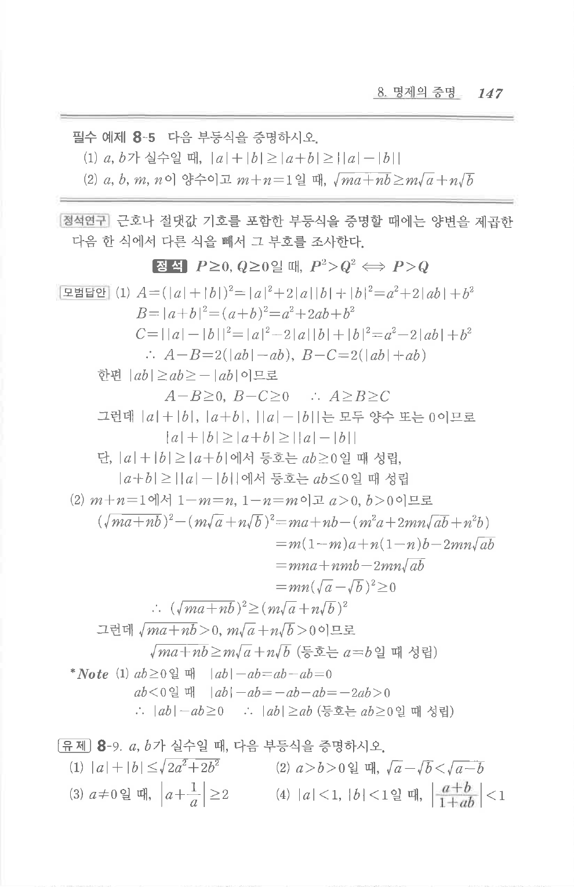

# 유제 8-9

## 문제

$a,b$가 실수일 때, 다음 부등식을 증명하시오.

(1) $$|a|+|b|\le \sqrt{2a^2+2b^2}$$

(2) $a>b>0$일 때,

$$\sqrt{a}-\sqrt{b}<\sqrt{a-b}$$

(3) $a\ne 0$일 때,

$$\left|a+\frac{1}{a}\right|\ge 2$$

(4) $|a|<1$, $|b|<1$일 때,

$$\left|\frac{a+b}{1+ab}\right|<1$$

## 원문 문제

## 원문

