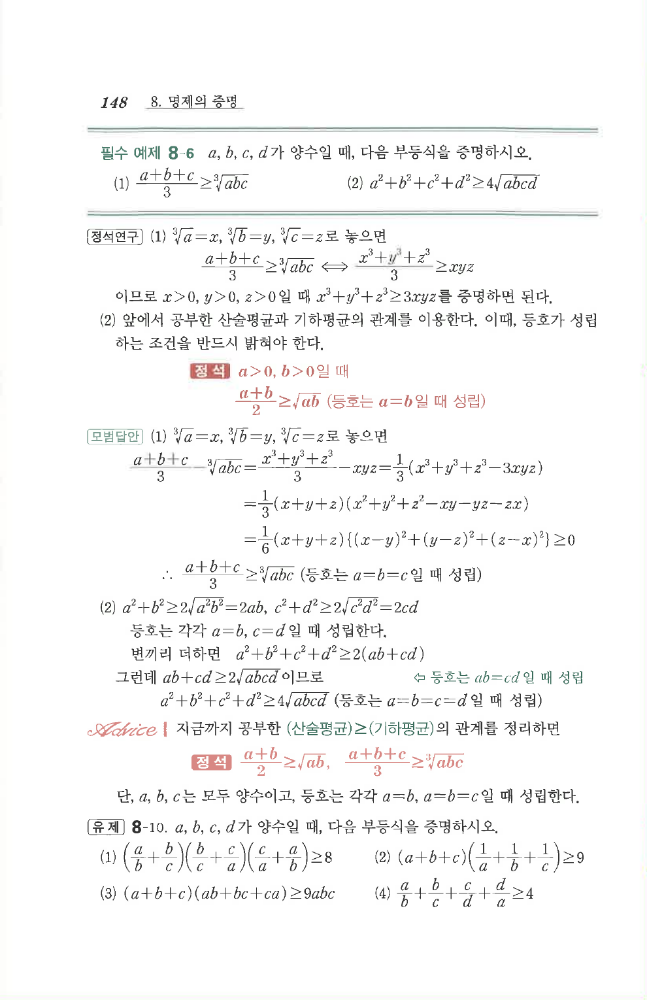

# 유제 8-10

## 문제

$a,b,c,d$가 양수일 때, 다음 부등식을 증명하시오.

(1) $$\left(\frac{a}{b}+\frac{b}{c}\right)\left(\frac{b}{c}+\frac{c}{a}\right)\left(\frac{c}{a}+\frac{a}{b}\right)\ge 8$$

(2) $$(a+b+c)\left(\frac{1}{a}+\frac{1}{b}+\frac{1}{c}\right)\ge 9$$

(3) $$(a+b+c)(ab+bc+ca)\ge 9abc$$

(4) $$\frac{a}{b}+\frac{b}{c}+\frac{c}{d}+\frac{d}{a}\ge 4$$

## 원문 문제

## 원문

