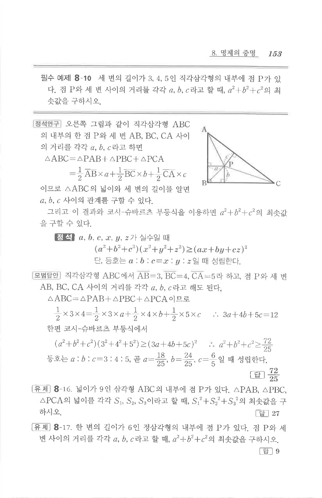

# 유제 8-16

## 문제

넓이가 $9$인 삼각형 $ABC$의 내부에 점 $P$가 있다. $\triangle PAB$, $\triangle PBC$, $\triangle PCA$의 넓이를 각각 $S_1,S_2,S_3$이라고 할 때, $S_1^2+S_2^2+S_3^2$의 최솟값을 구하시오.

## 정답

27

## 도형

삼각형 내부의 점 $P$가 세 꼭짓점과 연결되어 삼각형 $PAB$, $PBC$, $PCA$로 나뉘는 상황이다.

## 원문 문제

## 원문

