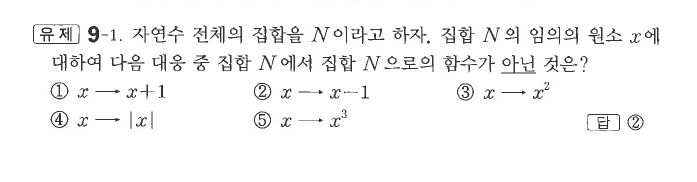

# 유제 9-1

## 문제

자연수 전체의 집합을 $N$이라고 하자. 집합 $N$의 임의의 원소 $x$에 대하여 다음 대응 중 집합 $N$에서 집합 $N$으로의 함수가 아닌 것은?

① $x\mapsto x+1$

② $x\mapsto x-1$

③ $x\mapsto x^2$

④ $x\mapsto |x|$

⑤ $x\mapsto x^3$

## 정답

②

## 원문

