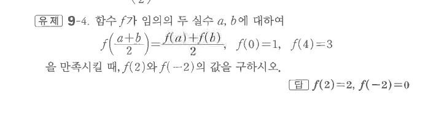

# 유제 9-4

## 문제

함수 $f$가 임의의 두 실수 $a,b$에 대하여
$$f\left(\frac{a+b}{2}\right)=\frac{f(a)+f(b)}2,\qquad f(0)=1,\qquad f(4)=3$$
을 만족시킬 때, $f(2)$와 $f(-2)$의 값을 구하시오.

## 정답

$$f(2)=2,\qquad f(-2)=0$$

## 원문

