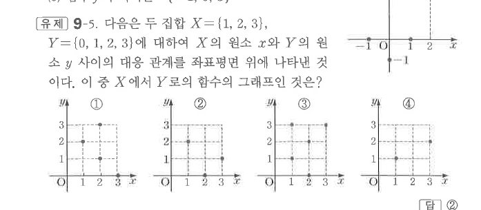
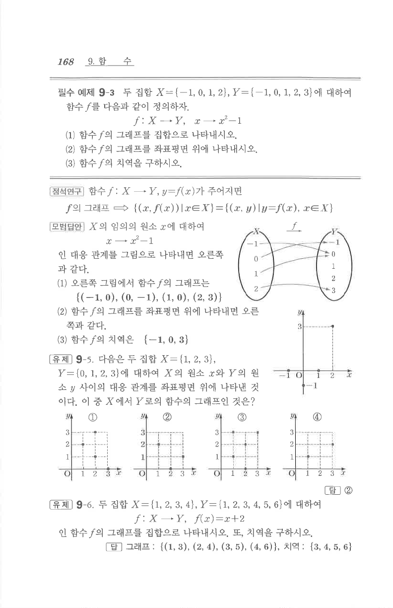

# 유제 9-5

## 문제

다음은 두 집합 $X=\{1,2,3\}$, $Y=\{0,1,2,3\}$에 대하여 $X$의 원소 $x$와 $Y$의 원소 $y$ 사이의 대응 관계를 좌표평면 위에 나타낸 것이다. 이 중 $X$에서 $Y$로의 함수의 그래프인 것은?

## 정답

②

## 도형

네 개의 유한집합 대응 그래프가 좌표평면 위의 점들로 제시되어 있다.

## 원문

