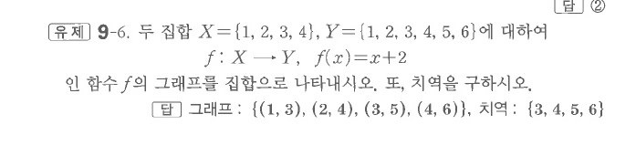

# 유제 9-6

## 문제

두 집합
$$X=\{1,2,3,4\},\qquad Y=\{1,2,3,4,5,6\}$$
에 대하여
$$f:X\to Y,\qquad f(x)=x+2$$
인 함수 $f$의 그래프를 집합으로 나타내시오. 또, 치역을 구하시오.

## 정답

그래프: $\{(1,3),(2,4),(3,5),(4,6)\}$

치역: $\{3,4,5,6\}$

## 원문

