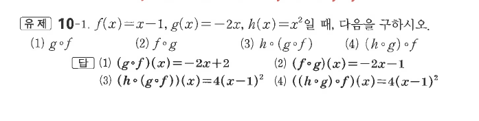
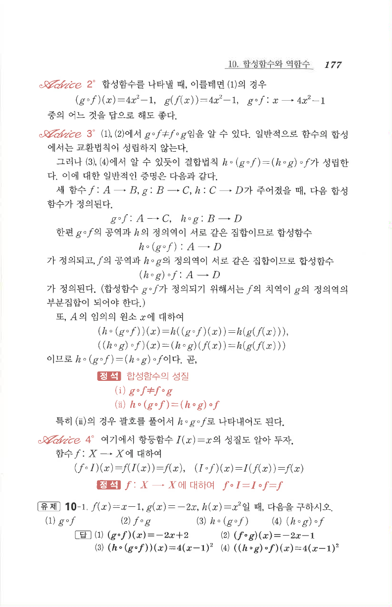

# 유제 10-1

## 문제

$f(x)=x-1$, $g(x)=-2x$, $h(x)=x^2$일 때, 다음을 구하시오.

1. $g\circ f$
2. $f\circ g$
3. $h\circ(g\circ f)$
4. $(h\circ g)\circ f$

## 정답

1. $(g\circ f)(x)=-2x+2$
2. $(f\circ g)(x)=-2x-1$
3. $(h\circ(g\circ f))(x)=4(x-1)^2$
4. $((h\circ g)\circ f)(x)=4(x-1)^2$

## 원문

