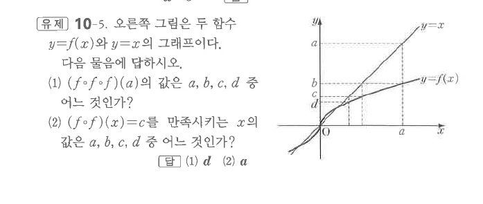
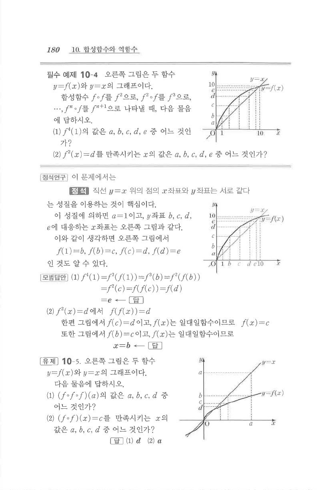

# 유제 10-5

## 문제

오른쪽 그림은 두 함수 $y=f(x)$와 $y=x$의 그래프이다. 다음 물음에 답하시오.

1. $(f\circ f\circ f)(a)$의 값은 $a$, $b$, $c$, $d$ 중 어느 것인가?
2. $(f\circ f)(x)=c$를 만족시키는 $x$의 값은 $a$, $b$, $c$, $d$ 중 어느 것인가?

## 정답

1. $d$
2. $a$

## 도형

증가하는 함수 $y=f(x)$와 직선 $y=x$가 함께 있으며, 표시점 $a,b,c,d$ 사이의 반복 대응을 읽는 그래프이다.

## 원문

