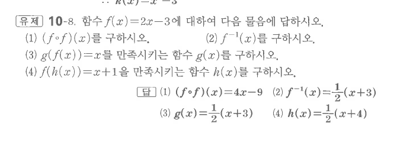
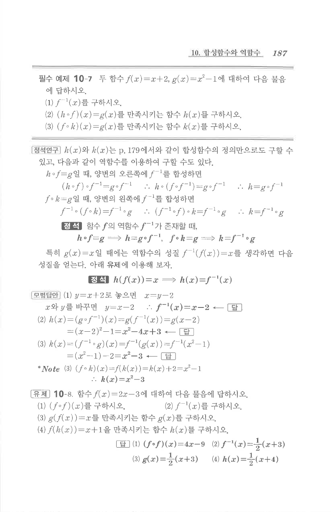

# 유제 10-8

## 문제

함수 $f(x)=2x-3$에 대하여 다음 물음에 답하시오.

1. $(f\circ f)(x)$를 구하시오.
2. $f^{-1}(x)$를 구하시오.
3. $g(f(x))=x$를 만족시키는 함수 $g(x)$를 구하시오.
4. $f(h(x))=x+1$을 만족시키는 함수 $h(x)$를 구하시오.

## 정답

1. $(f\circ f)(x)=4x-9$
2. $f^{-1}(x)=\dfrac12(x+3)$
3. $g(x)=\dfrac12(x+3)$
4. $h(x)=\dfrac12(x+4)$

## 원문

