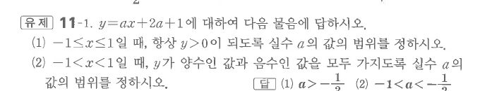

# 유제 11-1

## 문제

$y=ax+2a+1$에 대하여 다음 물음에 답하시오.

1. $-1\le x\le1$일 때, 항상 $y>0$이 되도록 실수 $a$의 값의 범위를 정하시오.
2. $-1<x<1$일 때, $y$가 양수인 값과 음수인 값을 모두 가지도록 실수 $a$의 값의 범위를 정하시오.

## 정답

1. $a> -\dfrac13$
2. $-1<a<-\dfrac13$

## 원문

