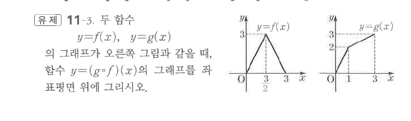

# 유제 11-3

## 문제

두 함수 $y=f(x)$, $y=g(x)$의 그래프가 오른쪽 그림과 같을 때, 함수 $y=(g\circ f)(x)$의 그래프를 좌표평면 위에 그리시오.

## 도형

$f$는 꼭짓점이 위에 있는 삼각형 모양의 선분 그래프이고, $g$는 증가하는 꺾은선 그래프이다. $f(x)$의 출력값을 $g$의 입력값으로 넣어 $g(f(x))$를 그리는 문제이다.

## 원문

