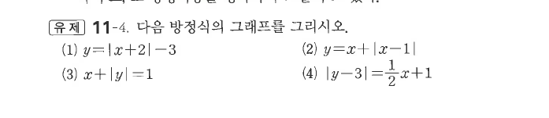
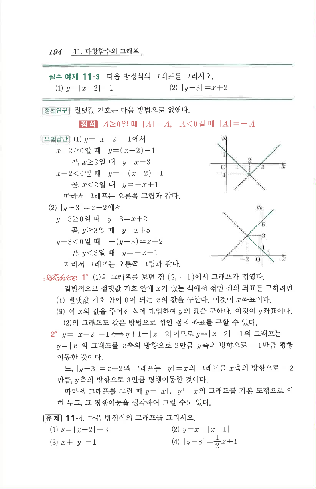

# 유제 11-4

## 문제

다음 방정식의 그래프를 그리시오.

1. $y=|x+2|-3$
2. $y=x+|x-1|$
3. $x+|y|=1$
4. $|y-3|=\dfrac12x+1$

## 도형

절댓값 안이 $0$이 되는 지점을 기준으로 직선 조각을 나누어 그리는 문제이다. (1)은 V자 그래프, (3)과 (4)는 $y$에 대한 절댓값 때문에 좌우 또는 상하 대칭 구조가 나타난다.

## 원문

