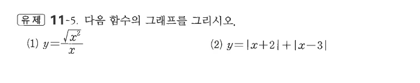

# 유제 11-5

## 문제

다음 함수의 그래프를 그리시오.

1. $y=\dfrac{\sqrt{x^2}}{x}$
2. $y=|x+2|+|x-3|$

## 도형

(1)은 $x>0$에서 $y=1$, $x<0$에서 $y=-1$이고 $x=0$에서는 정의되지 않는다. (2)는 $x=-2$, $x=3$을 기준으로 세 구간으로 나뉘며 가운데 구간에서는 상수값을 갖는다.

## 원문

