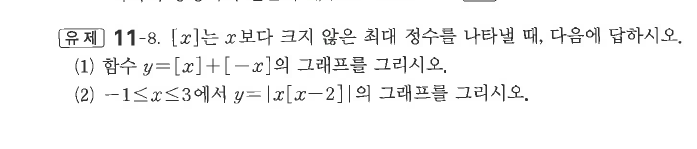
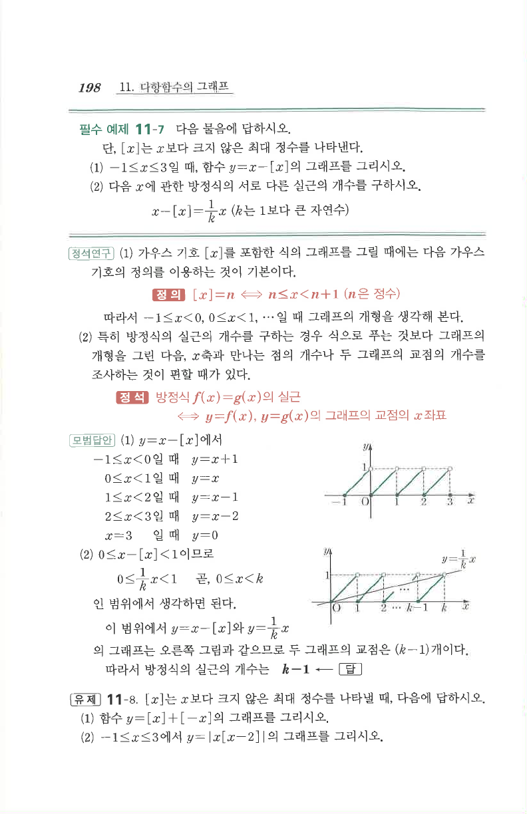

# 유제 11-8

## 문제

$[x]$는 $x$보다 크지 않은 최대 정수를 나타낼 때, 다음에 답하시오.

1. 함수 $y=[x]+[-x]$의 그래프를 그리시오.
2. $-1\le x\le3$에서 $y=|x[x-2]|$의 그래프를 그리시오.

## 도형

가우스 기호 때문에 각 정수 구간마다 값이 달라지는 계단형 또는 조각형 그래프가 된다. 열린 원과 닫힌 점의 위치를 원문 크롭 기준으로 확인한다.

## 원문

