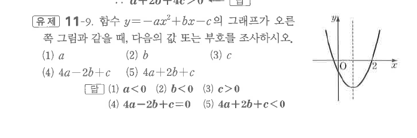

# 유제 11-9

## 문제

함수 $y=-ax^2+bx-c$의 그래프가 오른쪽 그림과 같을 때, 다음의 값 또는 부호를 조사하시오.

1. $a$
2. $b$
3. $c$
4. $4a-2b+c$
5. $4a+2b+c$

## 정답

1. $a<0$
2. $b<0$
3. $c>0$
4. $4a-2b+c=0$
5. $4a+2b+c<0$

## 도형

위로 볼록한 포물선이 $x$축과 $x=-2$, $x=2$ 부근에서 만나는 그림이다. 축과 절편의 위치로 계수와 식의 부호를 판단한다.

## 원문

