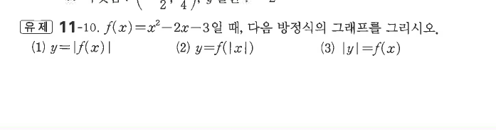
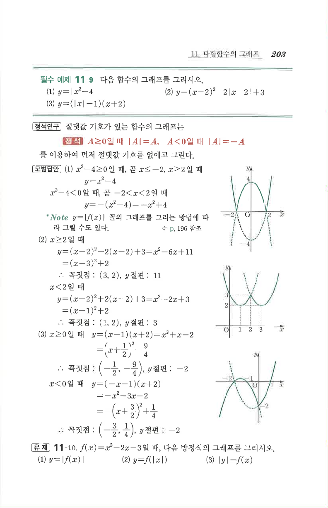

# 유제 11-10

## 문제

$f(x)=x^2-2x-3$일 때, 다음 방정식의 그래프를 그리시오.

1. $y=|f(x)|$
2. $y=f(|x|)$
3. $|y|=f(x)$

## 도형

$f(x)$의 포물선을 기준으로, (1)은 $x$축 아래 부분을 위로 접고, (2)는 $x\ge0$의 그래프를 $y$축 대칭으로 복사하며, (3)은 $y\ge0$ 부분을 $x$축 대칭으로 복사한다.

## 원문

