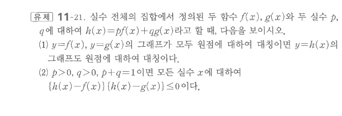

# 유제 11-21

## 문제

실수 전체의 집합에서 정의된 두 함수 $f(x)$, $g(x)$와 두 실수 $p$, $q$에 대하여
$$h(x)=pf(x)+qg(x)$$
라고 할 때, 다음을 보이시오.

1. $y=f(x)$, $y=g(x)$의 그래프가 모두 원점에 대하여 대칭이면 $y=h(x)$의 그래프도 원점에 대하여 대칭이다.
2. $p>0$, $q>0$, $p+q=1$이면 모든 실수 $x$에 대하여
$$\{h(x)-f(x)\}\{h(x)-g(x)\}\le0$$
이다.

## 원문

