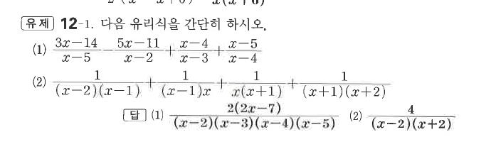
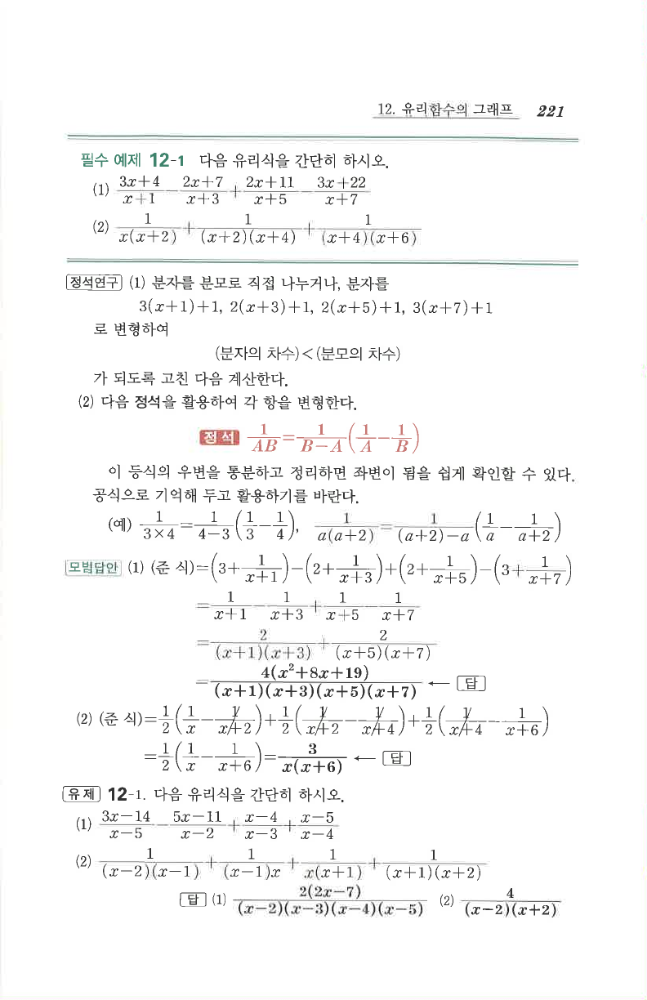

# 유제 12-1

## 문제

다음 유리식을 간단히 하시오.

1. $$\frac{3x-14}{x-5}-\frac{5x-11}{x-2}+\frac{x-4}{x-3}+\frac{x-5}{x-4}$$
2. $$\frac1{(x-2)(x-1)}+\frac1{(x-1)x}+\frac1{x(x+1)}+\frac1{(x+1)(x+2)}$$

## 정답

1. $\dfrac{2(2x-7)}{(x-2)(x-3)(x-4)(x-5)}$
2. $\dfrac4{(x-2)(x+2)}$

## 원문

