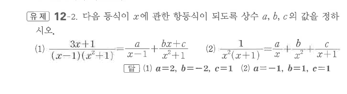
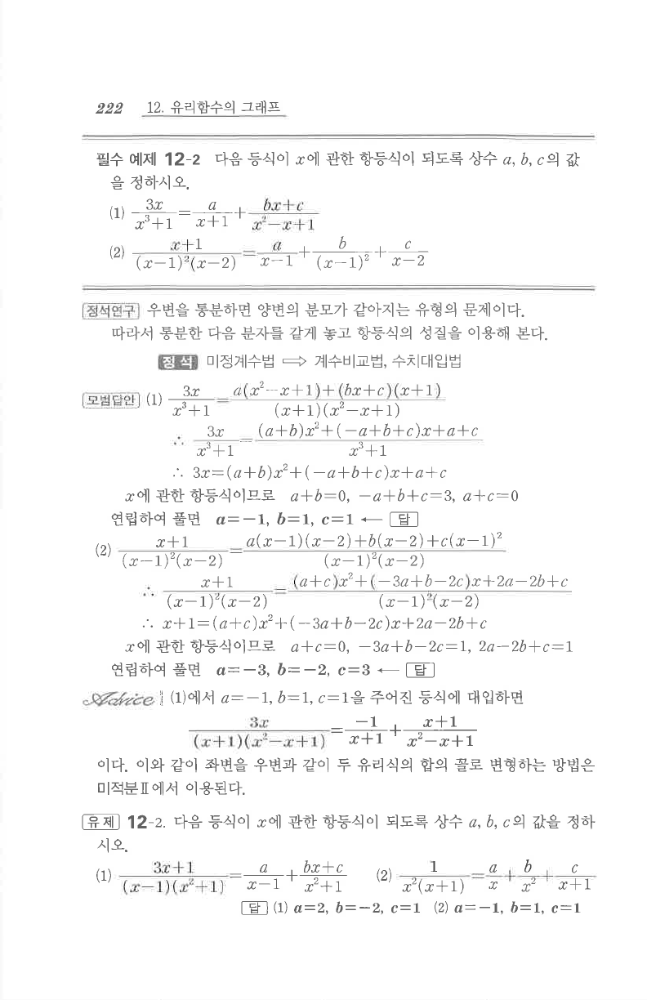

# 유제 12-2

## 문제

다음 등식이 $x$에 관한 항등식이 되도록 상수 $a$, $b$, $c$의 값을 정하시오.

1. $$\frac{3x+1}{(x-1)(x^2+1)}=\frac{a}{x-1}+\frac{bx+c}{x^2+1}$$
2. $$\frac1{x^2(x+1)}=\frac{a}{x}+\frac{b}{x^2}+\frac{c}{x+1}$$

## 정답

1. $a=2$, $b=-2$, $c=1$
2. $a=-1$, $b=1$, $c=1$

## 원문

