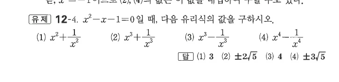
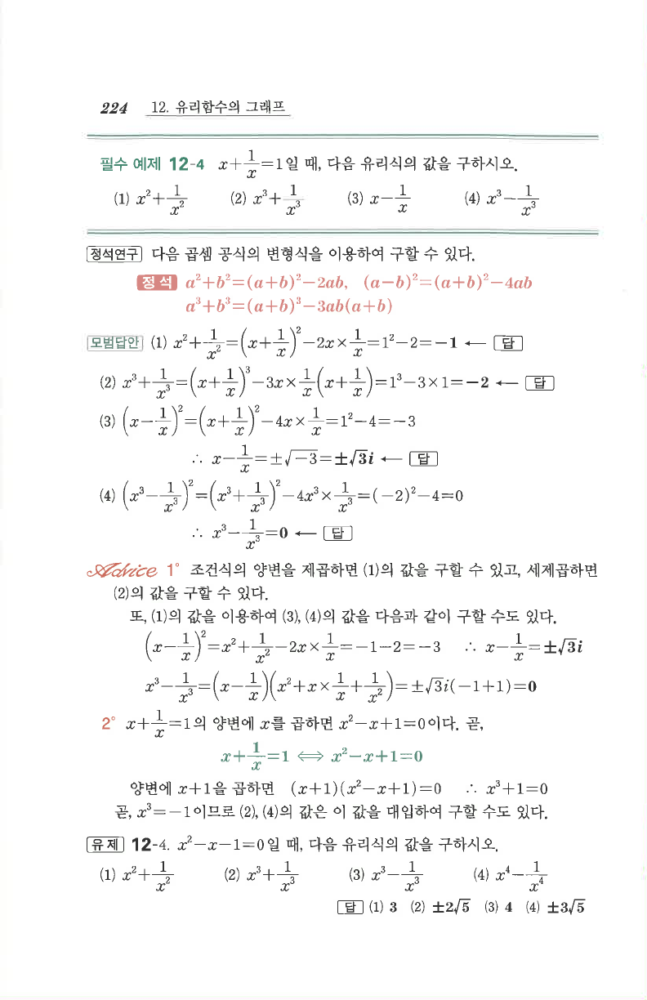

# 유제 12-4

## 문제

$x^2-x-1=0$일 때, 다음 유리식의 값을 구하시오.

1. $x^2+\dfrac1{x^2}$
2. $x^3+\dfrac1{x^3}$
3. $x^3-\dfrac1{x^3}$
4. $x^4-\dfrac1{x^4}$

## 정답

1. $3$
2. $\pm2\sqrt5$
3. $4$
4. $\pm3\sqrt5$

## 원문

