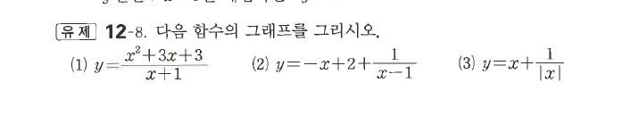

# 유제 12-8

## 문제

다음 함수의 그래프를 그리시오.

1. $y=\dfrac{x^2+3x+3}{x+1}$
2. $y=-x+2+\dfrac1{x-1}$
3. $y=x+\dfrac1{|x|}$

## 도형

(1), (2)는 사선 점근선을 가지는 유리함수이다. (3)은 $x>0$과 $x<0$에서 각각 $y=x+\frac1x$, $y=x-\frac1x$로 나뉜다.

## 원문

