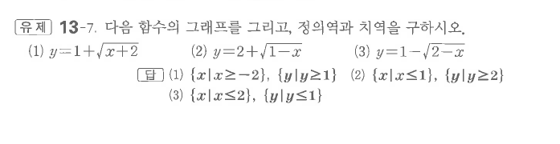
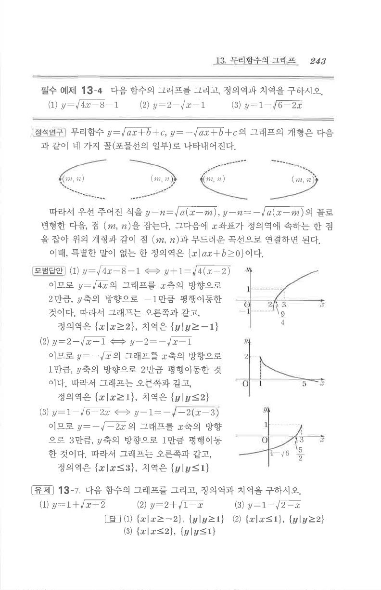

# 유제 13-7

## 문제

다음 함수의 그래프를 그리고, 정의역과 치역을 구하시오.

1. $y=1+\sqrt{x+2}$
2. $y=2+\sqrt{1-x}$
3. $y=1-\sqrt{2-x}$

## 정답

1. 정의역 $\{x\mid x\ge-2\}$, 치역 $\{y\mid y\ge1\}$
2. 정의역 $\{x\mid x\le1\}$, 치역 $\{y\mid y\ge2\}$
3. 정의역 $\{x\mid x\le2\}$, 치역 $\{y\mid y\le1\}$

## 도형

각 그래프는 기본 무리함수 그래프의 평행이동 또는 좌우 반전이다. 시작점은 각각 $(-2,1)$, $(1,2)$, $(2,1)$이다.

## 원문

