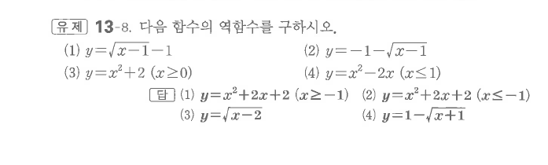
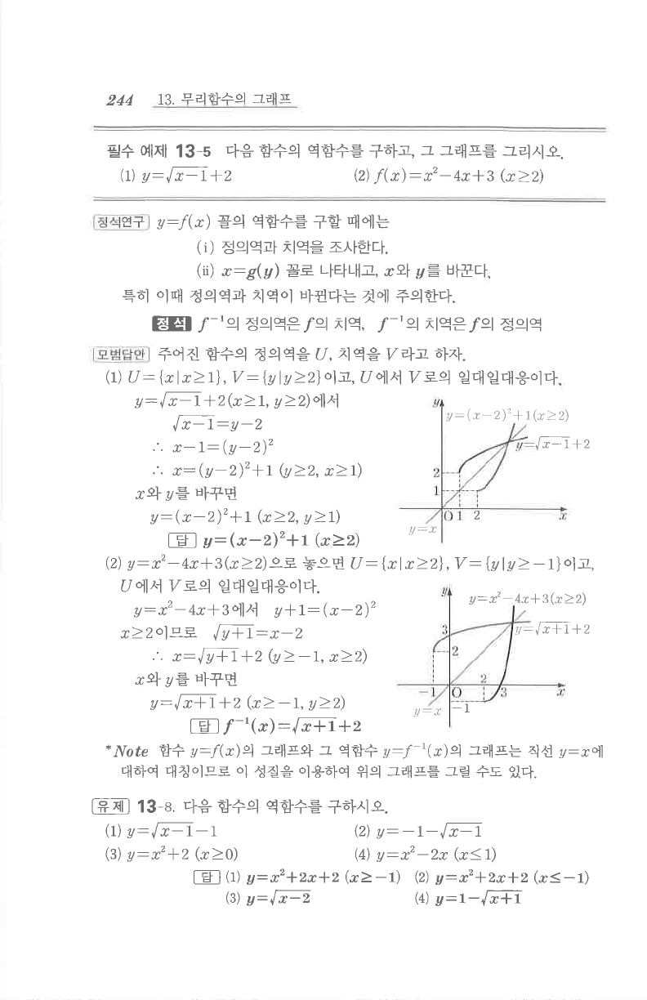

# 유제 13-8

## 문제

다음 함수의 역함수를 구하시오.

1. $y=\sqrt{x-1}-1$
2. $y=-1-\sqrt{x-1}$
3. $y=x^2+2\quad(x\ge0)$
4. $y=x^2-2x\quad(x\le1)$

## 정답

1. $y=x^2+2x+2\quad(x\ge-1)$
2. $y=x^2+2x+2\quad(x\le-1)$
3. $y=\sqrt{x-2}$
4. $y=1-\sqrt{x+1}$

## 원문

