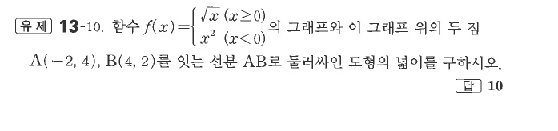

# 유제 13-10

## 문제

함수
$$
f(x)=\begin{cases}
\sqrt{x} & (x\ge0)\\
x^2 & (x<0)
\end{cases}
$$
의 그래프와 이 그래프 위의 두 점 $A(-2,4)$, $B(4,2)$를 잇는 선분 $AB$로 둘러싸인 도형의 넓이를 구하시오.

## 정답

$10$

## 도형

$x<0$에서는 포물선, $x\ge0$에서는 무리함수 그래프이며, 두 점 $A$, $B$를 잇는 선분이 닫힌 영역의 경계를 이룬다.

## 원문

