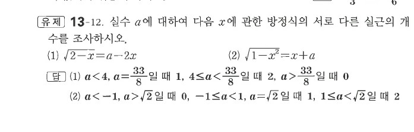
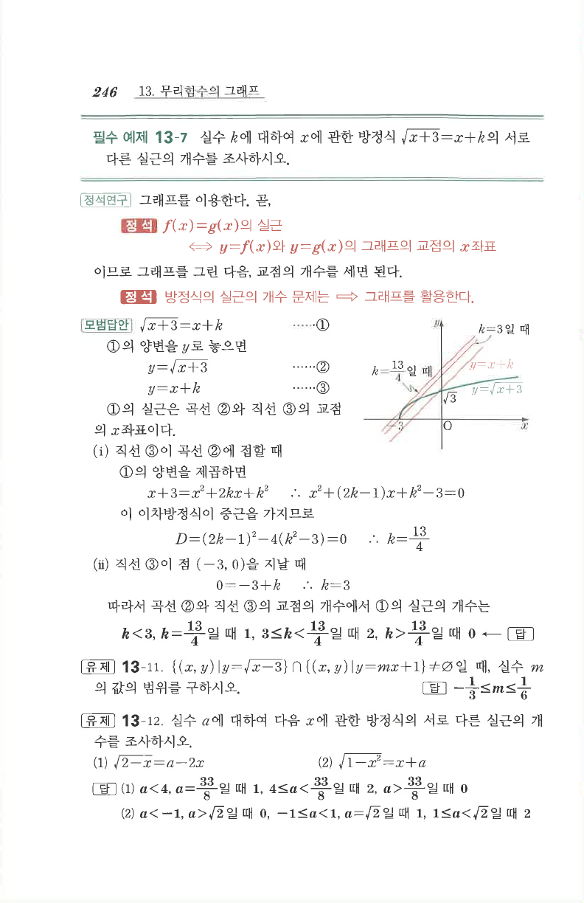

# 유제 13-12

## 문제

실수 $a$에 대하여 다음 $x$에 관한 방정식의 서로 다른 실근의 개수를 조사하시오.

1. $\sqrt{2-x}=a-2x$
2. $\sqrt{1-x^2}=x+a$

## 정답

1. $a<4$ 또는 $a=\dfrac{33}{8}$일 때 $1$개, $4\le a<\dfrac{33}{8}$일 때 $2$개, $a>\dfrac{33}{8}$일 때 $0$개이다.
2. $a<-1$ 또는 $a>\sqrt2$일 때 $0$개, $-1\le a<1$ 또는 $a=\sqrt2$일 때 $1$개, $1\le a<\sqrt2$일 때 $2$개이다.

## 원문

