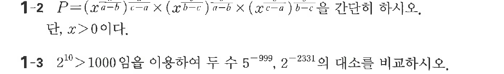

# 연습문제 1-2

## 문제

$$P=\left(x^{\frac{a}{a-b}}\right)^{\frac{a}{c-a}}\times\left(x^{\frac{b}{b-c}}\right)^{\frac{b}{a-b}}\times\left(x^{\frac{c}{c-a}}\right)^{\frac{c}{b-c}}$$

을 간단히 하시오. 단, $x>0$이다.

## 원문 문제

## 원문

