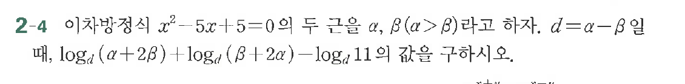

# 연습문제 2-4

## 문제

이차방정식 $x^2 - 5x + 5 = 0$의 두 근을 $\alpha, \beta (\alpha > \beta)$라고 하자. $d = \alpha - \beta$일 때, $\log_d(\alpha + 2\beta) + \log_d(\beta + 2\alpha) - \log_d 11$의 값을 구하시오.

## 원문 문제

## 원문

