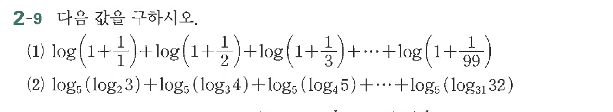

# 연습문제 2-9

## 문제

다음 값을 구하시오.

(1) $$\log\left(1+\frac{1}{2}\right)+\log\left(1+\frac{1}{3}\right)+\cdots+\log\left(1+\frac{1}{99}\right)$$

(2) $$\log_5(\log_2 3)+\log_5(\log_3 4)+\log_5(\log_4 5)+\cdots+\log_5(\log_{31} 32)$$

## 원문 문제

## 원문

