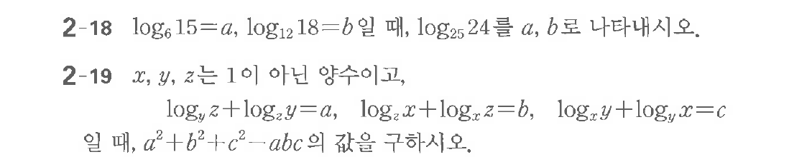

# 연습문제 2-18

## 문제

$\log_6 15 = a$, $\log_{12} 18 = b$일 때, $\log_{25} 24$를 $a, b$로 나타내시오.

**연습문제 2-19**
$x, y, z$는 $1$이 아닌 양수이고,
$$\begin{cases} \log_y z + \log_y x = a \\ \log_x z + \log_x y = b \\ \log_y x + \log_z y = c \end{cases}$$
일 때, $a^2 + b^2 + c^2 - abc$의 값을 구하시오.

## 원문 문제

## 원문

